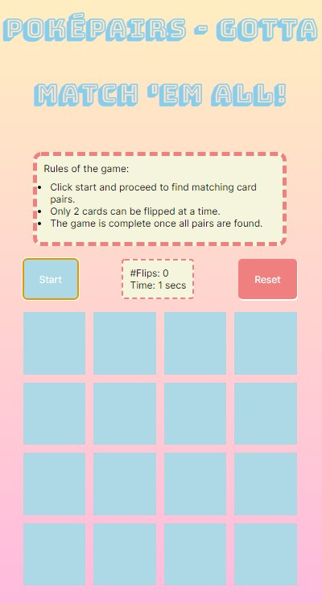

# Poke-Pairs Game

This is my first attempt at creating a game using vanilla JavaScript. Click [here](https://kav97.github.io/card-memory-game/) to view the project.

## Rules of the game

- Click start and proceed to find matching card pairs.
- Only 2 cards can be flipped at a time.
- The game is complete once all pairs are found.
  

| Game View |
|:---:|
|| 